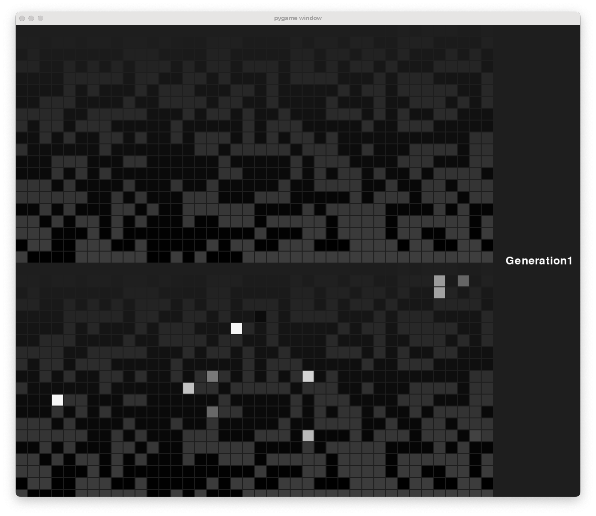

# Grid Simulation with Pygame

A dynamic grid-based simulation using Pygame, where each cell represents an organism with a unique DNA value displayed in grayscale. The simulation updates and displays the current generation in real-time.



## Features

- **Grid Visualization**: Each organism's DNA is represented by a grayscale cell within the grid.
- **Real-Time Generation Tracking**: Displays the current generation number on the screen.
- **Adjustable Frame Delay**: Control the speed of the simulation by setting the delay between frames.

## Requirements

This project requires Python 3.x and the pygame library. Ensure both are installed before running the project.

### Installing Pygame

Install Pygame using pip:
```
pip install pygame
```
## Usage

1. **Clone the Repository**:

   Clone the repository to your local machine:
   ```
   git clone https://github.com/yourusername/your-repository.git
   cd your-repository
   ```
2. **Set Up the Environment**:

   Ensure all dependencies are installed. You can install Pygame as follows:
   ```
   pip install pygame
   ```
3. **Configure Parameters**:

   In the code, you can adjust several parameters for the simulation:

   - `camouflage_color`: RGB tuple that sets the background color for the grid.
   - `organisms`: A NumPy array representing each organism’s DNA value, which determines the grayscale color of each cell.
   - `delay_ms`: Integer specifying the delay between frames in milliseconds, allowing control over the simulation speed.

4. **Run the Simulation**:

   Execute the main Python file to start the simulation:

   python main.py

   The program will display a grid, where each cell represents an organism with a grayscale color based on its DNA value. The current generation number will update in real-time on the right side of the window.

## Contributing

We welcome contributions from the community! If you’d like to contribute:

1. Fork the repository.
2. Create a new branch for your feature or bug fix.
3. Submit a pull request with a detailed description of your changes.

Please ensure your code adheres to PEP 8 standards and includes relevant documentation and comments.

## License

This project is licensed under the MIT License - see the LICENSE file for details.

## Contact

For questions, feedback, or suggestions, feel free to reach out:

- **Email**: carloscold50@gmail.com
- **GitHub**: irondog421
